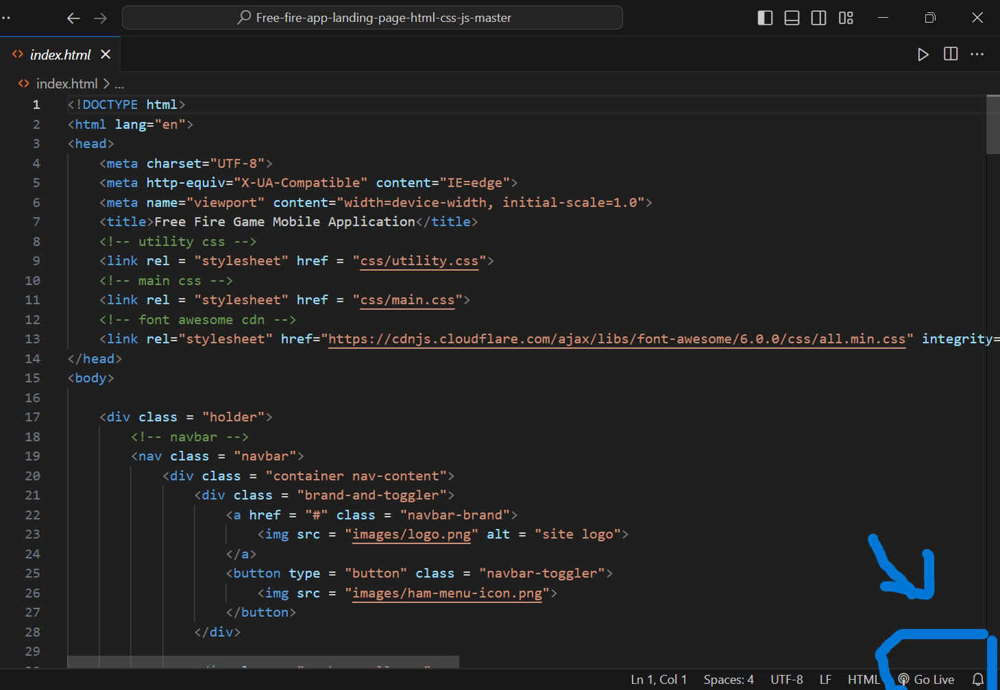
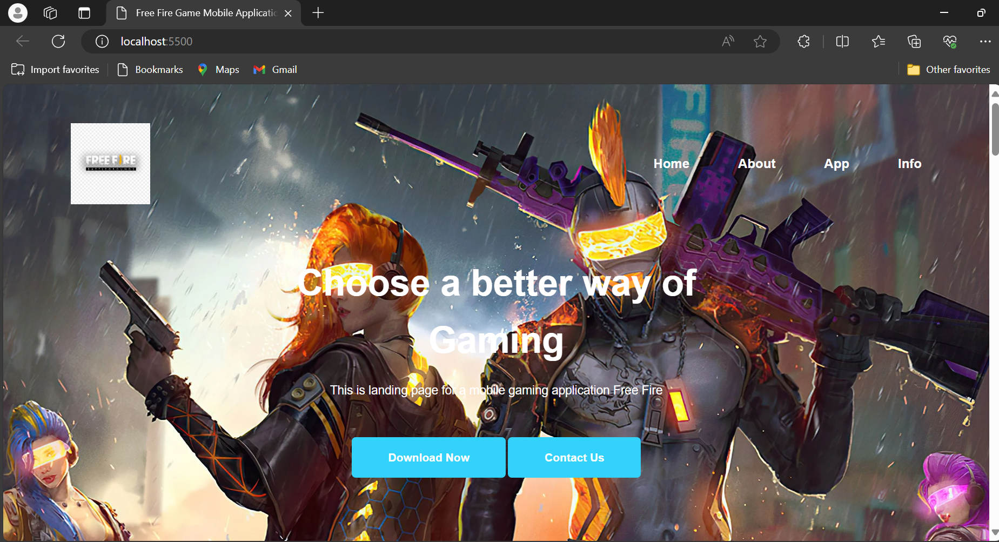
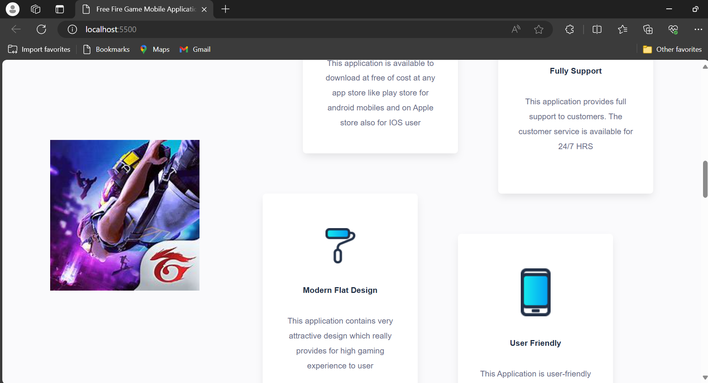
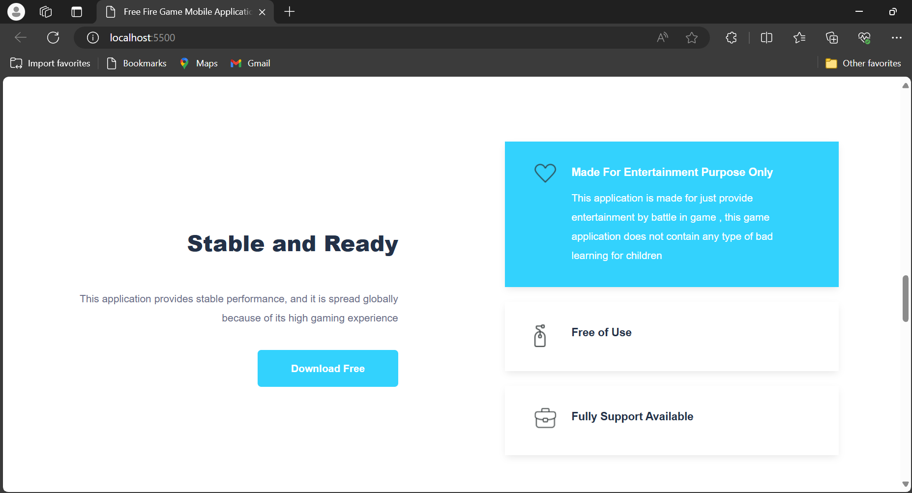
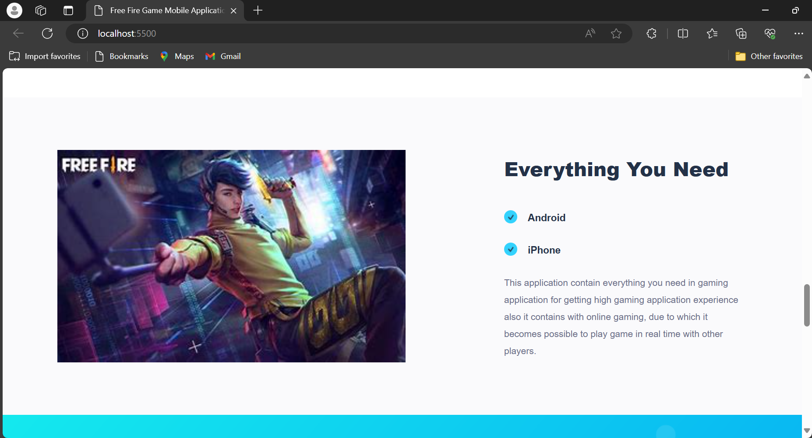
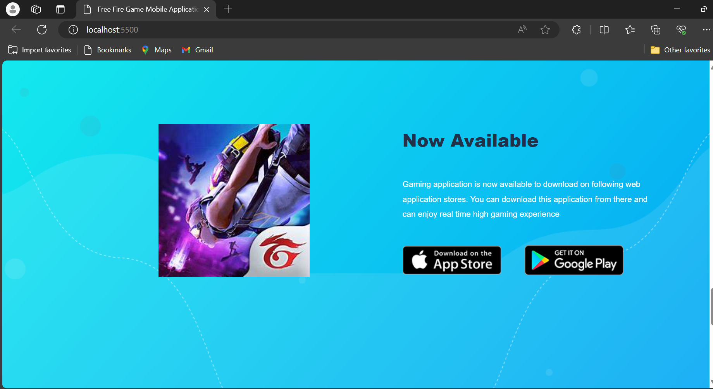
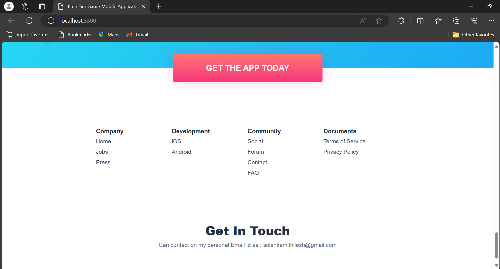

* Step 1: Download folder zip file 
* Step 2: Extract zip file and open your file into visual or pycharm computing software
* Step 3: In Visual studio open the HTML file and click on right bottom Button "GO LIVE"

* Step 4: After clicking on go live this webpage will available on local host:  http://localhost:5500/

After pasting this local host IP in browser you will be able to see DASHBOARD as following :

So this is responsive landing page for gaming application Free Fire.

This landing page can provide us brief information about free Fire Application. Along with that it provides 
contact service for Free Fire Application if any problem is happen we can contact Free Fire support service from there, over there after clicking on
contact us it will redirect user to official Free Fire page from where you can contact.

It also provides link for downloading this application in android for it gives us suggestion to download it from play store, and it also provides path to 
path download along it provide option to download application for ios devices.

This landing page also provide option to contact server handler for this my email id is given over there as : solankemithlesh@gmail.com  